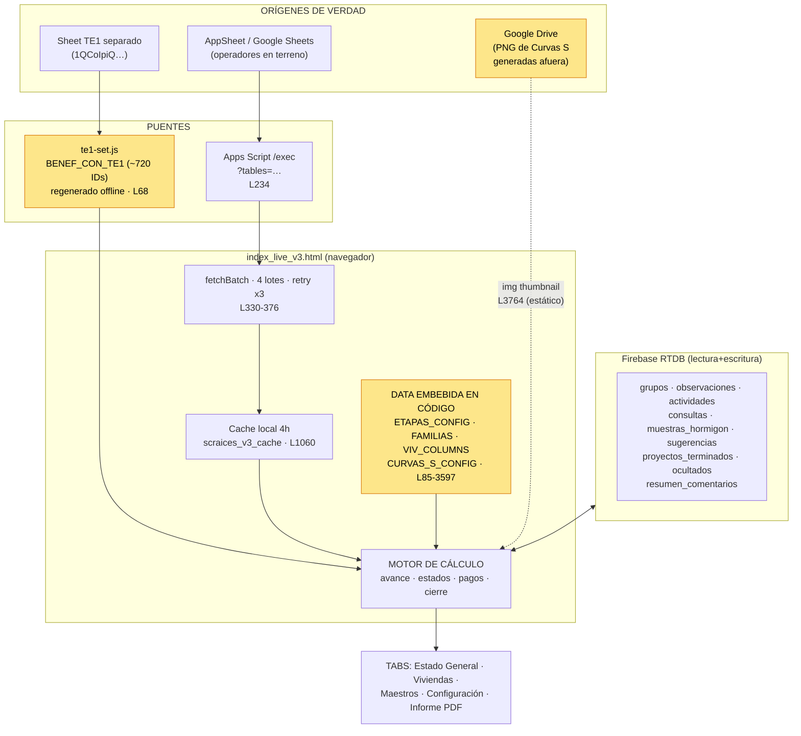
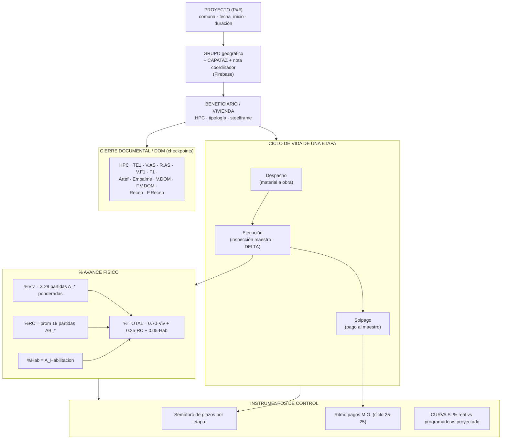
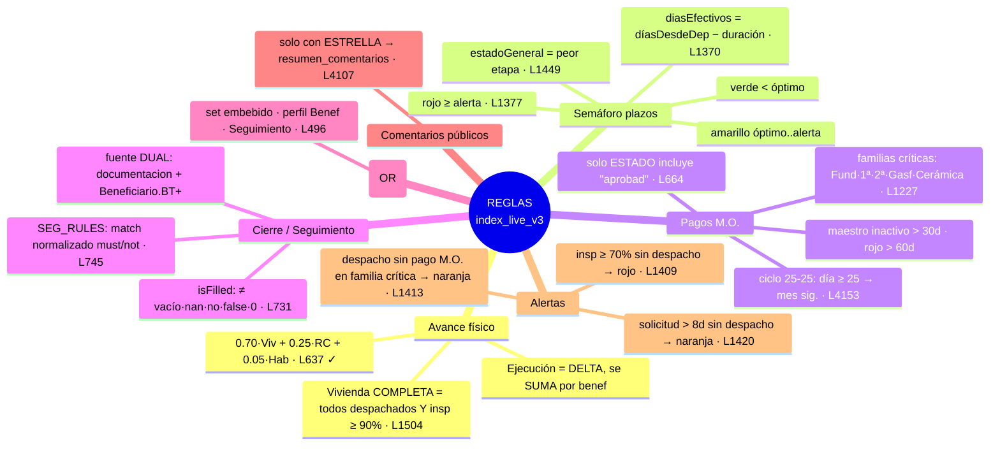
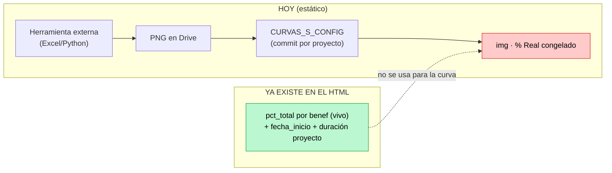

# Mapa Conceptual — `dashboard/index_live_v3.html`

> Radiografía del dashboard de control de obra de SCRaices: **de dónde saca la información, qué reglas aplica y qué sabe del negocio**. Objetivo: validar lo que está bien y corregir lo que no calza con el modelo de negocio que debe supervisar (construcción de viviendas sociales por proyecto/grupo/beneficiario).
>
> Fuentes de la validación: lectura directa del HTML (líneas citadas), `CLAUDE.md`, `SOURCES_OF_TRUTH.md`, `Etapas.md`, `config/etapas_config.json`, `RELACIONES_TABLAS.md`.

---

## 0. Qué es este archivo (en una frase)

Una **SPA React (Babel in-browser) de un solo archivo** publicada en GitHub Pages que descarga datos de Google Sheets (vía Apps Script) y Firebase, calcula avance/estados/pagos en el navegador, y los presenta a un **coordinador de obra** para supervisar el cumplimiento de plazos, pagos a maestros y cierre documental (DOM) de cada vivienda.

---

## 1. Gráfico conceptual — FUENTES DE INFORMACIÓN

**Tablas que descarga** (`TABLES_TO_FETCH`, L235): `Proyectos, Beneficiario, Despacho, soldepacho, Ejecucion, Solpago, Maestros, Tabla_pago, Tipologias, controlBGB, controlEEPP, Seguimiento` + (lote 1) variantes de `documentacion`/`Seguimiento Cierre`, + (lote 4) `combenef`.

**En amarillo = datos que viven hardcodeados/offline** (no se refrescan solos): `CURVAS_S_CONFIG`, `te1-set.js`, `ETAPAS_CONFIG`.

---

## 2. Gráfico conceptual — CONOCIMIENTO DEL NEGOCIO (modelo de dominio)

**Lo que el dashboard *sabe* del negocio:**
- SCRaices construye **vivienda social** agrupada por proyecto → grupo (con capataz) → beneficiario.
- Cada vivienda avanza por **13 etapas** con dependencias y ruta crítica (Fundaciones → 1ª Etapa → 2ª Etapa → Cerámico Muro → Gasfitería).
- El avance físico se mide por **partidas ponderadas** (no por etapas despachadas).
- Hay un **flujo de plata** paralelo: pago a maestros por familia de partida, controlado por ciclo 25-25.
- Hay un **flujo administrativo** de cierre con la DOM (recepción municipal) rastreado por checkpoints.
- El **coordinador** es el usuario; el tab "Estado General" es **compartible hacia afuera** (por eso el filtro estrella y la nota del coordinador).

---

## 3. Gráfico conceptual — REGLAS DE NEGOCIO CODIFICADAS

---

## 4. VALIDACIÓN — lo que está bien vs lo que hay que corregir

| # | Aspecto | Estado | Detalle |
|---|---|:---:|---|
| 1 | Fórmula % avance `0.70/0.25/0.05` | ✅ Correcto | L637 coincide con `CLAUDE.md` y `SOURCES_OF_TRUTH`. |
| 2 | Filtro Solpago `"aprobad"` + suma por benef | ✅ Correcto | L664. Coherente con el control de plata real. |
| 3 | Ciclo de pagos 25-25 | ✅ Correcto | L4153. Refleja el cierre contable real de SCRaices. |
| 4 | TE1 triple fuente (OR) | ✅ Correcto | L496-963. Robusto ante datos repartidos. |
| 5 | Filtro estrella para comentarios públicos | ✅ Correcto | L4107. Bien alineado con que el tab se comparte afuera. |
| 6 | Matching `SEG_RULES` normalizado | ✅ Correcto pero frágil | L745. Tolera variantes AppSheet, pero depende de keywords; cualquier renombre de columna lo rompe en silencio. |
| 7 | **Curvas S = imágenes Drive estáticas** | ❌ **A corregir (crítico)** | L3530-3766. El instrumento central de supervisión está **desconectado** de la data viva (ver §5). |
| 8 | Triple copia de tiempos de etapa | ⚠️ Drift | `ETAPAS_CONFIG` embebido (mod. 2026-01-26) vs `config/etapas_config.json` vs `Etapas.md` **no coinciden** entre sí (ej. 1ª/2ª etapa óptimo/alerta). Viola DRY → el semáforo del dashboard puede mentir respecto a la regla "oficial". |
| 9 | Dos definiciones de semáforo | ⚠️ Ambiguo | `CLAUDE.md` define semáforo "días desde última solicitud (7/14)"; el código usa `óptimo/alerta` por etapa desde despacho de dependencia. Son **modelos distintos**; hay que decidir cuál es el de negocio. |
| 10 | "Ritmo Despachos" como proxy de avance | ⚠️ Temporal | `SOURCES_OF_TRUTH` lo marca "TEMPORAL v1, reemplazar por % avance real de Ejecución". Sigue siendo conteo de despachos. |
| 11 | Reglas Firebase abiertas | ❌ Riesgo | RTDB sin auth: cualquiera con la URL lee/escribe `observaciones`, `grupos`, etc. Compromete la integridad de lo que el coordinador supervisa. |
| 12 | Mensaje "se actualizan cada lunes 08:00" | ⚠️ Engañoso | L3766. En el HTML no hay automatización; el `CURVAS_S_CONFIG` se edita a mano por commit. O existe un cron externo no documentado, o el texto promete algo que no ocurre. |
| 13 | Umbrales de color inconsistentes | ⚠️ Menor (UX) | Completa = ≥90% (L1504), barra avance verde = ≥80% (L1537), inspección verde = ≥90% (L1699). Tres escalas para "qué tan avanzado". |
| 14 | Sensibilidad mayúsculas `ID_Proy`/`ID_proy` | ⚠️ Frágil | Mitigado con `String()`, pero un cambio de esquema AppSheet rompe joins en silencio. |

---

## 5. El hallazgo central: la Curva S no supervisa, ilustra

El negocio que este dashboard debe supervisar es **cumplimiento de cronograma**. El instrumento canónico para eso es la **Curva S (real vs programado)**. Sin embargo:

- El "% Real" que muestra la curva es una **foto vieja** dentro de un PNG; el dashboard **ya calcula el % real vivo** (`pct_total`) y no lo usa para la curva.
- Cada proyecto nuevo cuesta: generar imágenes afuera → subir a Drive → copiar IDs → **commit + push** (5 líneas por proyecto). No escala.
- Riesgo de negocio: el coordinador puede tomar decisiones sobre una curva desactualizada mientras la data real ya cambió.

---

## 6. Recomendaciones de optimización (priorizadas por valor de negocio)

| Prioridad | Acción | Por qué |
|:---:|---|---|
| 🔴 P1 | **Calcular la Curva S desde data viva.** Reemplazar el PNG por un SVG (ya existe `svgLineChartString`, L3395): % Real = serie histórica de `pct_total`; % Programado = baseline desde `fecha_inicio`+`duración`+pesos de etapa. | Convierte el dashboard en herramienta de supervisión real, elimina el trabajo manual por proyecto y el riesgo de curva desactualizada. |
| 🔴 P2 | **Endurecer reglas de Firebase** (auth + reglas por nodo). | Hoy cualquiera puede alterar lo que el coordinador supervisa. |
| 🟠 P3 | **Unificar la config de etapas en una sola fuente.** Que el HTML lea `etapas_config.json` (o generarlo en build) en vez de duplicar `ETAPAS_CONFIG`. Decidir y documentar un único modelo de semáforo. | Elimina el drift (#8/#9): hoy el semáforo puede contradecir la regla oficial. |
| 🟠 P4 | **Reemplazar "Ritmo Despachos" por % avance real** (deltas de Ejecución). | Cierra el pendiente "TEMPORAL v1" y da una señal de actividad fiel. |
| 🟡 P5 | Quitar/condicionar el texto "se actualizan cada lunes 08:00" o automatizar de verdad esa regeneración. | Evita que el coordinador confíe en un dato que no se refresca. |
| 🟡 P6 | Unificar las escalas de color (un solo umbral de "avanzado"). Validar `SEG_RULES` con un panel de salud que avise si un checkpoint quedó sin columna. | Consistencia de lectura y detección temprana de cambios de esquema AppSheet. |

---

*Generado el 2026-06-15. Mantener sincronizado con `SOURCES_OF_TRUTH.md` si se aplican las correcciones.*
